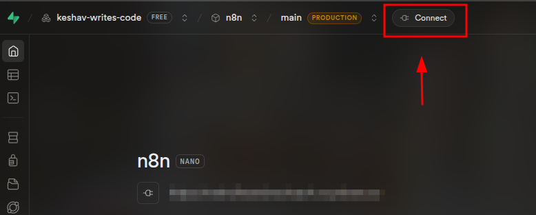
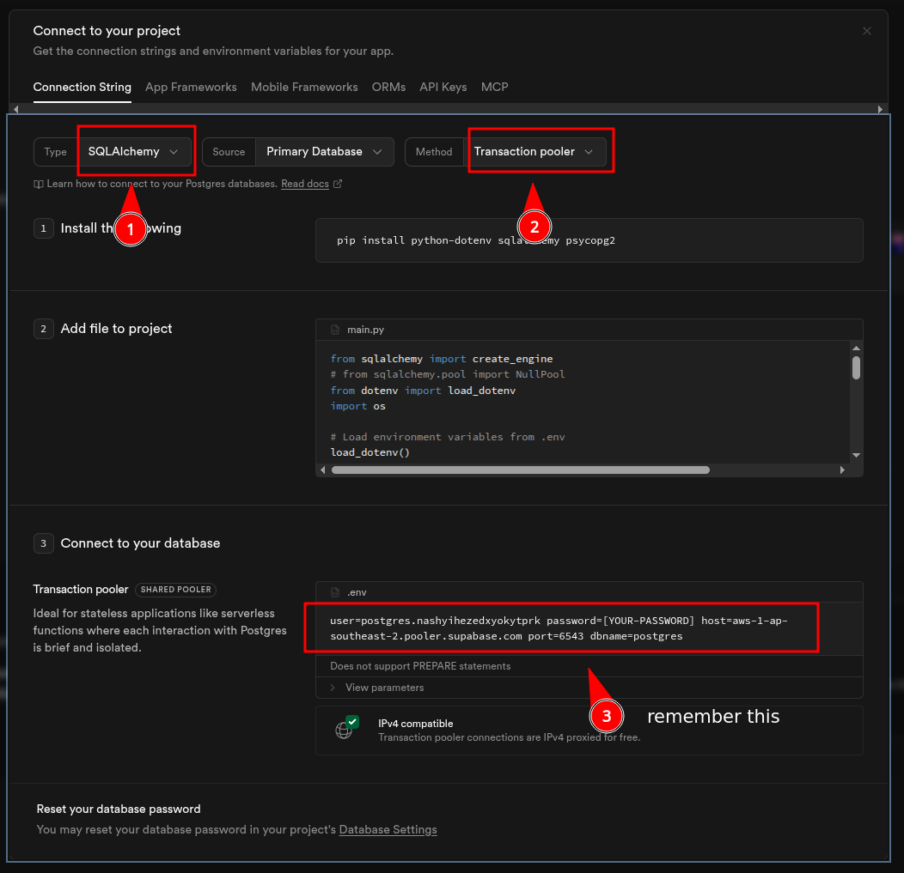

import { Steps } from "@astrojs/starlight/components";

## What is the Plan? 
### Memory : [`supabase`](http://supabase.com/)

n8n needs a Postgress DB to store  workflows, credentials, etc.\
we are going to be using [ supabase](http://supabase.com/) as the Postgress DB Provider

### Compute : [`render`](https://render.com/):
Runs the actual n8n app, gives us a public url to use n8n from 

### Awaker : [`cron-job`](https://cron-job.org/en/)
Render will spin down the n8n service after 15 mintues of inactivity\
so we're gonna ping the service after 14 mintues forever to keep it active and not spin down by setting up a cron job in [cron-job.org](cron-job.org)

## Steps :

### Setup Supabase

<Steps>

1. #### Signup/Signin 
    click this link : [`supabase`](https://supabase.com/dashboard/organizations) to signup or signin
2. #### Create a Project 
    click **`New organization`** button
      - name it with your own name, doesn't matter
      - select **`Type`** to be `Personal`
      - select **`Plan`** to be `Free`
      - click **`Create new organization`**

    click **`New project`** button
      - **`Organization`** to be whatever is selected by default
      - **`Project name`** to be `n8n-db`, doesn't really matter
      - **`Database password`** to be a new password that we will need shortly 
      - **`Region`** to be a `West US (Oregon)` Region (because Render's Region will also be that)
      - **`Security`** to default settings
      - click **`Create new project`**

3. #### Get Credentials 
      click the **`Connect`** button in the top bar

    

    then do these things :
      - set `Type` to `SQLAlchemy`
      - `Method` to `Transcation pooler`
      - remeber (copy) the block of text just right to `Transcation pooler (SHARED POOLER)`

    

</Steps>

### Setup Render

<Steps>

1. #### Signup/Signin 
    signup or signin to [`render`](https://dashboard.render.com/web/new)

2. #### Create a Web Service 
    
    create a new webservice by :
      - open [`New Web Service`](https://dashboard.render.com/web/new) page
      - click `Existing Image`
      - `Import Url` to be  this
        ```url
        docker.n8n.io/n8nio/n8n
        ```
      - click **`Connect`**

3. #### Configure Web Service Creation

    in the next page, set :
      - `Name` to be anything, eg. `n8n`
      - Region to be `US (Oregon)`
      - `Instance Type` to be `Free`
      - `Environment Variables` to match this :

        |Key|Value|
        |-|-|
        |`DB_POSTGRESDB_DATABASE`|`postgres`|
        |`DB_POSTGRESDB_HOST`|the `host` value from the supabase page|
        |`DB_POSTGRESDB_PASSWORD`|the `Database password` of the supabase project|
        |`DB_POSTGRESDB_PORT`|the `port` value from the supabase page|
        |`DB_POSTGRESDB_SCHEMA`|`public`|
        |`DB_POSTGRESDB_USER`|the `user` value from the supabase page|
        |`DB_TYPE`|`postgresdb`|
        |`N8N_ENCRYPTION_KEY`|set to litteraly any random string|

      - click **`Deploy Web Service`**

4. #### After Web Service Creation

    after deployment, you will be forwarded to the  webservice dashboard we just created \
    we need to set more environment variables for proper functioning of n8n
      - go to `Left Sidebar` > `Environment` > `Environment Variables` > `Edit` > `Add`
      - and add these environment vairbales :
        |Key|Value|
        |-|-|
        |`N8N_EDITOR_BASE_URL`|the url that render has deployed n8n to, can be found on top of the dashbaord |
        |`WEBHOOK_URL`|the url that render has deployed n8n to, can be found on top of the dashbaord |
      - then click **`Save and deploy`**
</Steps>

### Setup Cron Job

<Steps>

1. #### Signup/Signin 

    signup or signin to [`cron-job.org`](https://console.cron-job.org/dashboard)

2. #### Create Conjob

    - go to the [ dashboard ](https://console.cron-job.org/dashboard)
    - click **`Create Cronjob`**
    - set `Tile` to `Keep n8n Awake`
    - set `Url` to the url render deployed n8n to. can be found on the top of Web Service page in Render
    - set `Crontab expression` to :
      ```
      */14 * * * *
      ```
    - click **`Create `**


</Steps>
